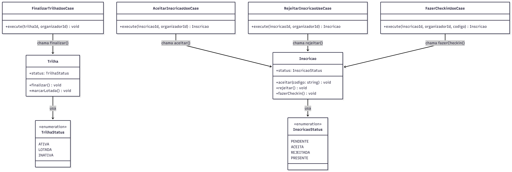

# 3.3.4 State

## Participantes

| Matrícula | Nome                                                    | Commits                                                                                                                   |
| :-------- | :------------------------------------------------------ | :------------------------------------------------------------------------------------------------------------------------ |
| 222006211 | [Vitor Hoffmann](https://github.com/vitor-hoffmann)     | [4b6942c](https://github.com/UnBArqDsw2026-1-Turma01/2026.1-T01-_G5_BelezasNaturaisBrasileiras_Entrega_01/commit/4b6942c) |
| 222015060 | [Ana Luiza](https://github.com/ana-pfeilsticker)        | [4b6942c](https://github.com/UnBArqDsw2026-1-Turma01/2026.1-T01-_G5_BelezasNaturaisBrasileiras_Entrega_01/commit/4b6942c) |
| 222021998 | [Mateus Magno](https://github.com/mtsmgn0)                 | [4b6942c](https://github.com/UnBArqDsw2026-1-Turma01/2026.1-T01-_G5_BelezasNaturaisBrasileiras_Entrega_01/commit/4b6942c) |
|           | [Mário Vinícius](https://github.com/MarioViniciusBC)    | [4b6942c](https://github.com/UnBArqDsw2026-1-Turma01/2026.1-T01-_G5_BelezasNaturaisBrasileiras_Entrega_01/commit/4b6942c) |
|           | [Antônio Carvalho](https://github.com/antonioscarvalho) | [4b6942c](https://github.com/UnBArqDsw2026-1-Turma01/2026.1-T01-_G5_BelezasNaturaisBrasileiras_Entrega_01/commit/4b6942c) |

## Introdução

O **State** é um padrão comportamental que permite que um objeto altere seu comportamento quando seu estado interno muda, parecendo mudar de classe. Em vez de condicionar todo o comportamento a verificações do tipo `if (status === X)`, o próprio objeto encapsula as regras de transição nos métodos da entidade, tornando transições inválidas impossíveis em tempo de execução.

O padrão State está intimamente relacionado com o conceito de uma Máquina de Estados Finita. A ideia principal é que, a qualquer momento, o programa pode estar em um número finito de estados. Em cada estado, o programa se comporta de forma diferente e pode mudar de um estado para outro instantaneamente. No desenvolvimento de software, esse padrão ajuda a evitar estruturas condicionais massivas (`if-else` ou `switch`) que tentam gerenciar comportamentos baseados em estados, movendo essas responsabilidades para dentro da própria entidade ou para objetos de estado dedicados.

## Quando Aplicar?

- Quando você tem um objeto que se comporta de maneira diferente dependendo do seu estado atual, o número de estados é grande, e o código específico do estado muda com frequência.
- Quando você tem uma classe preenchida com condicionais massivas que alteram como a classe se comporta de acordo com os valores atuais dos campos da classe.
- Quando você tem muito código duplicado em estados e transições de estado semelhantes de uma máquina de estados baseada em condicionais.
- Quando é necessário garantir que transições inválidas entre estados sejam impossibilitadas por design.

## Metodologia

O padrão State foi aplicado em duas entidades de domínio do sistema BNB, cada uma com seu próprio ciclo de vida: `Trilha` e `Inscricao`.

A abordagem adotada é **State interno à entidade**: em vez de criar classes de estado separadas (o modelo clássico do GoF), os estados são representados pelos enums `TrilhaStatus` e `InscricaoStatus`, e as transições — com suas pré-condições — são encapsuladas como métodos da própria entidade. Essa variação é fiel ao princípio do padrão (o objeto controla suas transições e rejeita operações inválidas), mantendo-o pragmático para o tamanho do projeto.

**Máquina de estado de `Trilha`:**

O ciclo de vida de uma trilha percorre três estados: `ATIVA` → `LOTADA` → `INATIVA`. O método `marcarLotada()` é chamado automaticamente quando as vagas se esgotam; o método `finalizar()` encerra a trilha independentemente de estar ativa ou lotada, mas lança uma exceção se já estiver `INATIVA`.

**Máquina de estado de `Inscricao`:**
Uma inscrição segue o fluxo `PENDENTE` → `ACEITA`/`REJEITADA` → `PRESENTE`. Cada método de transição na entidade `Inscricao` atua como um guardião, verificando se o estado atual permite a mudança solicitada. Por exemplo, não é permitido fazer check-in em uma inscrição que não tenha sido previamente `ACEITA`. Essa centralização da lógica de estado na entidade de domínio simplifica os Use Cases, que apenas invocam as transições e tratam possíveis erros de violação de estado.

## Estrutura e Participantes

### Trilha

| Classe / Enum            | Papel no Padrão | Responsabilidade                                                                   |
| :----------------------- | :-------------- | :--------------------------------------------------------------------------------- |
| `TrilhaStatus`           | State (enum)    | Define os estados possíveis: `ATIVA`, `LOTADA`, `INATIVA`                          |
| `Trilha`                 | Context         | Armazena o estado atual e encapsula as transições `finalizar()` e `marcarLotada()` |
| `FinalizarTrilhaUseCase` | Client          | Invoca `trilha.finalizar()` sem conhecer as regras internas de transição           |

### Inscricao

| Classe / Enum              | Papel no Padrão | Responsabilidade                                                                               |
| :------------------------- | :-------------- | :--------------------------------------------------------------------------------------------- |
| `InscricaoStatus`          | State (enum)    | Define os estados possíveis: `PENDENTE`, `ACEITA`, `REJEITADA`, `PRESENTE`                     |
| `Inscricao`                | Context         | Armazena o estado atual e encapsula as transições `aceitar()`, `rejeitar()` e `fazerCheckin()` |
| `AceitarInscricaoUseCase`  | Client          | Invoca `inscricao.aceitar(codigo)` — a entidade valida o estado `PENDENTE`                     |
| `RejeitarInscricaoUseCase` | Client          | Invoca `inscricao.rejeitar()` — a entidade valida o estado `PENDENTE`                          |
| `FazerCheckinUseCase`      | Client          | Invoca `inscricao.fazerCheckin()` — a entidade valida o estado `ACEITA`                        |

## Diagrama de Classes



## Descrição das Classes

### `TrilhaStatus` (enum)

Define os três estados do ciclo de vida de uma trilha: `ATIVA` (disponível para inscrições), `LOTADA` (vagas esgotadas, sem novas inscrições) e `INATIVA` (finalizada, não aceita mais inscrições nem check-ins).

### `Trilha` (Context)

Entidade de domínio que mantém o estado atual em `status: TrilhaStatus`. Encapsula as transições:

- `marcarLotada()` — transita para `LOTADA`; chamada automaticamente quando vagas se esgotam.
- `finalizar()` — transita para `INATIVA`; lança `Error('Trilha já está finalizada')` se o estado já for `INATIVA`.

### `InscricaoStatus` (enum)

Define os quatro estados do ciclo de vida de uma inscrição: `PENDENTE`, `ACEITA`, `REJEITADA` e `PRESENTE`.

### `Inscricao` (Context)

Entidade de domínio que mantém o estado atual em `status: InscricaoStatus`. Encapsula as transições:

- `aceitar(codigo)` — exige `PENDENTE`; transita para `ACEITA` e salva o código de confirmação.
- `rejeitar()` — exige `PENDENTE`; transita para `REJEITADA`.
- `fazerCheckin()` — exige `ACEITA`; transita para `PRESENTE` e registra o timestamp do check-in.

## Trechos de Código

### Enum `TrilhaStatus`

> [`backend/src/modules/trilhas/domain/enums/TrilhaStatus.ts`](https://github.com/UnBArqDsw2026-1-Turma01/2026.1-T01-_G5_BelezasNaturaisBrasileiras_Entrega_01/blob/main/backend/src/modules/trilhas/domain/enums/TrilhaStatus.ts)

```typescript
export enum TrilhaStatus {
  ATIVA = "ATIVA",
  LOTADA = "LOTADA",
  INATIVA = "INATIVA",
}
```

### Enum `InscricaoStatus`

> [`backend/src/modules/inscricoes/domain/enums/InscricaoStatus.ts`](https://github.com/UnBArqDsw2026-1-Turma01/2026.1-T01-_G5_BelezasNaturaisBrasileiras_Entrega_01/blob/main/backend/src/modules/inscricoes/domain/enums/InscricaoStatus.ts)

```typescript
export enum InscricaoStatus {
  PENDENTE = "PENDENTE",
  ACEITA = "ACEITA",
  REJEITADA = "REJEITADA",
  PRESENTE = "PRESENTE",
}
```

### Entidade `Trilha` — transições de estado

> [`backend/src/modules/trilhas/domain/entities/Trilha.ts`](https://github.com/UnBArqDsw2026-1-Turma01/2026.1-T01-_G5_BelezasNaturaisBrasileiras_Entrega_01/blob/main/backend/src/modules/trilhas/domain/entities/Trilha.ts)

```typescript
export class Trilha {
  status: TrilhaStatus;

  finalizar(): void {
    if (this.status === TrilhaStatus.INATIVA) {
      throw new Error("Trilha já está finalizada");
    }
    this.status = TrilhaStatus.INATIVA;
  }

  marcarLotada(): void {
    this.status = TrilhaStatus.LOTADA;
  }
}
```

### Entidade `Inscricao` — transições de estado

> [`backend/src/modules/inscricoes/domain/entities/Inscricao.ts`](https://github.com/UnBArqDsw2026-1-Turma01/2026.1-T01-_G5_BelezasNaturaisBrasileiras_Entrega_01/blob/main/backend/src/modules/inscricoes/domain/entities/Inscricao.ts)

```typescript
export class Inscricao {
  status: InscricaoStatus;

  aceitar(codigo: string): void {
    if (this.status !== InscricaoStatus.PENDENTE) {
      throw new Error("Apenas inscrições pendentes podem ser aceitas");
    }
    this.status = InscricaoStatus.ACEITA;
    this.codigoConfirmacao = codigo;
    this.aceitoEm = new Date();
  }

  rejeitar(): void {
    if (this.status !== InscricaoStatus.PENDENTE) {
      throw new Error("Apenas inscrições pendentes podem ser rejeitadas");
    }
    this.status = InscricaoStatus.REJEITADA;
  }

  fazerCheckin(): void {
    if (this.status !== InscricaoStatus.ACEITA) {
      throw new Error("Apenas inscrições aceitas podem fazer check-in");
    }
    this.status = InscricaoStatus.PRESENTE;
    this.checkinEm = new Date();
  }
}
```

## Rotas Relacionadas

| Rota                                | Método | Descrição                                                                           | Como Testar                                                                                                |
| :---------------------------------- | :----- | :---------------------------------------------------------------------------------- | :--------------------------------------------------------------------------------------------------------- |
| `POST /trilhas/:id/finalizar`       | POST   | Finaliza a trilha (`ATIVA`/`LOTADA` → `INATIVA`). Requer JWT do organizador.        | Criar trilha, chamar a rota; tentar chamar novamente → deve retornar erro com "Trilha já está finalizada". |
| `POST /inscricoes/trilha/:trilhaId` | POST   | Solicita inscrição (cria com status `PENDENTE`). Requer JWT de usuário autenticado. | Criar trilha, autenticar usuário e chamar a rota.                                                          |
| `POST /inscricoes/:id/aceitar`      | POST   | Aceita inscrição (`PENDENTE` → `ACEITA`). Requer JWT do organizador.                | Aceitar inscrição pendente; tentar aceitar novamente → deve retornar erro.                                 |
| `POST /inscricoes/:id/rejeitar`     | POST   | Rejeita inscrição (`PENDENTE` → `REJEITADA`). Requer JWT do organizador.            | Rejeitar inscrição pendente; tentar rejeitar uma já aceita → deve retornar erro.                           |
| `POST /inscricoes/:id/checkin`      | POST   | Realiza check-in (`ACEITA` → `PRESENTE`). Valida código de confirmação.             | Aceitar inscrição, usar o código gerado e chamar a rota; usar código errado → erro de validação.           |

## Declaração de Uso de IA

Este documento e a implementação foram desenvolvidos com o auxílio da IA para otimizar a estrutura, apresentação do conteúdo e codificação. Todas as decisões de implementação, modelagem de classes e escolhas arquiteturais foram realizadas pela equipe com senso crítico e autoridade própria.

A IA foi utilizada como ferramenta de suporte em duas frentes:

**Documentação:**

- Otimização da estrutura e apresentação do padrão baseada no Refactoring Guru.
- Refinamento da apresentação técnica e diagramação.
- Geração de descrições técnicas precisas.

**Codificação:**

- Auxílio na criação da estrutura base do código
- A equipe utilizou de arquivos de especificação (specs) bem definidos para garantir que a AI seguisse fielmente o planejamento
- As escolhas arquiteturais foram realizadas EXCLUSIVAMENTE pela equipe
- A IA auxiliou na implementação mantendo todos os parâmetros e restrições estabelecidas pelo grupo

Cada implementação, diagrama e decisão foi revisado e alterado conforme as necessidades do projeto. A equipe mantém total responsabilidade pelas escolhas implementadas.

## Referências Bibliográficas

> Gamma, E., Helm, R., Johnson, R., & Vlissides, J. (1994). Design Patterns: Elements of Reusable Object-Oriented Software. Addison-Wesley.

> Refactoring Guru. State. Disponível em: https://refactoring.guru/design-patterns/state. Acesso em: 18 mai. 2026.

> Freeman, E., Freeman, E., Kathy, S., & Bates, B. (2004). Head First Design Patterns. O'Reilly Media.

## Histórico de versões

| Versão | Data       | Descrição                                                                                                                                                       | Autor                                            | Revisor                                   | Detalhamento da Revisão                                      |
| :----- | :--------- | :-------------------------------------------------------------------------------------------------------------------------------------------------------------- | :----------------------------------------------- | :---------------------------------------- | :----------------------------------------------------------- |
| `1.0`  | 18/05/2026 | Criação da estrutura do documento com seções de participantes, introdução, metodologia, estrutura de classes, diagrama e rotas.                                 | [Ana Luiza](https://github.com/ana-pfeilsticker) | ---                                       | ---                                                          |
| `1.1`  | 19/05/2026 | Preenchimento completo da documentação com metodologia, estrutura de participantes, diagrama de classes, descrição das classes e rotas para Trilha e Inscricao. | [Ana Luiza](https://github.com/ana-pfeilsticker) | [Mateus Magno](http://github.com/mtsmgn0) | Melhoria na descrição do padrão e alinhamento terminológico. |
