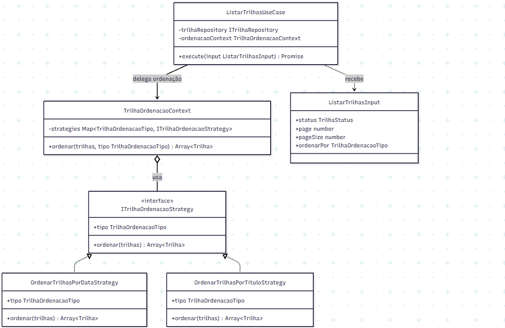

# 3.3.9 Strategy

## Participantes

| Matrícula | Nome | Commits |
| :-------- | :--- | :------ |
| 221031229 | [Paulo Filho](https://github.com/PauloFilho2) | [ba65a7d](https://github.com/UnBArqDsw2026-1-Turma01/2026.1-T01-_G5_BelezasNaturaisBrasileiras_Entrega_03/commit/ba65a7d54f3ec41b0ebe56021e6f945c17d3534a) |
|  | [Heloisa Santos](https://github.com/Heloisa-Santos) | [ba65a7d](https://github.com/UnBArqDsw2026-1-Turma01/2026.1-T01-_G5_BelezasNaturaisBrasileiras_Entrega_03/commit/ba65a7d54f3ec41b0ebe56021e6f945c17d3534a) |

## Introdução

O **Strategy** é um padrão comportamental que define uma família de algoritmos, encapsula cada um e torna-os intercambiáveis, deixando o cliente escolher qual usar. É útil quando você tem múltiplas formas de executar uma tarefa e deseja escolher em tempo de execução.

Este padrão permite que o algoritmo varie independentemente dos clientes que o usam.

## Quando Aplicar?

- Quando múltiplos algoritmos para uma tarefa estão disponíveis
- Quando você deseja evitar condicionalidade ao escolher um algoritmo
- Quando o algoritmo pode mudar em tempo de execução
- Quando você tem um algoritmo com diferentes variantes
- Quando classes cliente precisam usar diferentes variações de um comportamento

## Metodologia

O padrão Strategy foi aplicado à ordenação da listagem de trilhas. O sistema já possuía o padrão Iterator para filtrar e paginar trilhas, mas a escolha da forma de ordenação ainda poderia crescer com condicionais dentro do caso de uso.

A solução foi encapsular cada algoritmo de ordenação em uma classe própria. A interface `ITrilhaOrdenacaoStrategy` define o contrato comum, e cada estratégia concreta implementa uma forma específica de ordenar a lista. Foram criadas duas estratégias:

- `OrdenarTrilhasPorDataStrategy`, que ordena as trilhas por `dataInicio`;
- `OrdenarTrilhasPorTituloStrategy`, que ordena as trilhas alfabeticamente por `titulo`.

O `TrilhaOrdenacaoContext` funciona como o contexto do padrão. Ele recebe as estratégias disponíveis, armazena cada uma pelo seu tipo (`data` ou `titulo`) e escolhe qual algoritmo usar de acordo com o parâmetro `ordenarPor` recebido na listagem.

No `ListarTrilhasUseCase`, a ordenação foi posicionada depois do filtro e antes da paginação. Essa ordem é importante porque o sistema primeiro reduz a lista pelo status desejado, depois ordena o resultado filtrado e só então aplica `page` e `pageSize`.

## Estrutura e Participantes

| Classe                         | Papel no Padrão  | Responsabilidade                                                               |
| :----------------------------- | :--------------- | :----------------------------------------------------------------------------- |
| `ITrilhaOrdenacaoStrategy`     | Strategy         | Define o contrato comum para algoritmos de ordenação de trilhas                 |
| `OrdenarTrilhasPorDataStrategy` | Concrete Strategy | Ordena trilhas por data de início                                               |
| `OrdenarTrilhasPorTituloStrategy` | Concrete Strategy | Ordena trilhas pelo título em ordem alfabética                                  |
| `TrilhaOrdenacaoContext`       | Context          | Seleciona e executa a estratégia de ordenação solicitada                        |
| `ListarTrilhasUseCase`         | Cliente          | Usa o contexto para ordenar a lista antes de aplicar a paginação                 |
| `ListarTrilhasInput`           | Entrada          | Recebe o parâmetro opcional `ordenarPor` enviado pela query string              |

## Diagrama de Classes



## Descrição das Classes

**`ITrilhaOrdenacaoStrategy`** (`domain/strategies/ITrilhaOrdenacaoStrategy.ts`)

Interface do padrão Strategy. Define o tipo da estratégia e o método `ordenar(trilhas)`. Também declara o enum `TrilhaOrdenacaoTipo`, com as opções `DATA` e `TITULO`, evitando o uso de strings soltas no código.

**`OrdenarTrilhasPorDataStrategy`** (`domain/strategies/OrdenarTrilhasPorDataStrategy.ts`)

Estratégia concreta que ordena as trilhas por `dataInicio`, da data mais próxima para a mais distante. A implementação cria uma cópia da lista com `[...trilhas]` antes de chamar `sort()`, evitando alterar o array original.

**`OrdenarTrilhasPorTituloStrategy`** (`domain/strategies/OrdenarTrilhasPorTituloStrategy.ts`)

Estratégia concreta que ordena as trilhas alfabeticamente pelo campo `titulo`, usando `localeCompare()`. Assim, a regra de ordenação por título fica isolada em uma classe própria.

**`TrilhaOrdenacaoContext`** (`domain/strategies/TrilhaOrdenacaoContext.ts`)

Contexto do padrão Strategy. Recebe as estratégias por injeção de dependência, registra cada uma em um `Map` e escolhe qual deve ser executada. Se nenhum tipo for informado, usa a ordenação por data como padrão.

**`ListarTrilhasInput`** (`application/dtos/ListarTrilhasInput.ts`)

DTO de entrada da listagem. Foi adicionado o campo opcional `ordenarPor`, validado com `@IsEnum(TrilhaOrdenacaoTipo)`, para permitir que a API receba a estratégia desejada pela query string.

**`ListarTrilhasUseCase`** (`application/use-cases/ListarTrilhasUseCase.ts`)

Cliente do padrão. Busca todas as trilhas, aplica o filtro com Iterator, chama `TrilhaOrdenacaoContext.ordenar()` e, por fim, aplica paginação quando `page` e `pageSize` são informados.

## Trechos de Código

### `ITrilhaOrdenacaoStrategy` — contrato das estratégias

> [`backend/src/modules/trilhas/domain/strategies/ITrilhaOrdenacaoStrategy.ts`](https://github.com/UnBArqDsw2026-1-Turma01/2026.1-T01-_G5_BelezasNaturaisBrasileiras_Entrega_01/blob/main/backend/src/modules/trilhas/domain/strategies/ITrilhaOrdenacaoStrategy.ts)

```typescript
export enum TrilhaOrdenacaoTipo {
  DATA = 'data',
  TITULO = 'titulo',
}

export interface ITrilhaOrdenacaoStrategy {
  readonly tipo: TrilhaOrdenacaoTipo;
  ordenar(trilhas: Trilha[]): Trilha[];
}
```

### `OrdenarTrilhasPorDataStrategy` — ordenação por data

> [`backend/src/modules/trilhas/domain/strategies/OrdenarTrilhasPorDataStrategy.ts`](https://github.com/UnBArqDsw2026-1-Turma01/2026.1-T01-_G5_BelezasNaturaisBrasileiras_Entrega_01/blob/main/backend/src/modules/trilhas/domain/strategies/OrdenarTrilhasPorDataStrategy.ts)

```typescript
@Injectable()
export class OrdenarTrilhasPorDataStrategy implements ITrilhaOrdenacaoStrategy {
  readonly tipo = TrilhaOrdenacaoTipo.DATA;

  ordenar(trilhas: Trilha[]): Trilha[] {
    return [...trilhas].sort(
      (a, b) => a.dataInicio.getTime() - b.dataInicio.getTime(),
    );
  }
}
```

### `OrdenarTrilhasPorTituloStrategy` — ordenação por título

> [`backend/src/modules/trilhas/domain/strategies/OrdenarTrilhasPorTituloStrategy.ts`](https://github.com/UnBArqDsw2026-1-Turma01/2026.1-T01-_G5_BelezasNaturaisBrasileiras_Entrega_01/blob/main/backend/src/modules/trilhas/domain/strategies/OrdenarTrilhasPorTituloStrategy.ts)

```typescript
@Injectable()
export class OrdenarTrilhasPorTituloStrategy implements ITrilhaOrdenacaoStrategy {
  readonly tipo = TrilhaOrdenacaoTipo.TITULO;

  ordenar(trilhas: Trilha[]): Trilha[] {
    return [...trilhas].sort((a, b) => a.titulo.localeCompare(b.titulo));
  }
}
```

### `TrilhaOrdenacaoContext` — escolha da estratégia

> [`backend/src/modules/trilhas/domain/strategies/TrilhaOrdenacaoContext.ts`](https://github.com/UnBArqDsw2026-1-Turma01/2026.1-T01-_G5_BelezasNaturaisBrasileiras_Entrega_01/blob/main/backend/src/modules/trilhas/domain/strategies/TrilhaOrdenacaoContext.ts)

```typescript
@Injectable()
export class TrilhaOrdenacaoContext {
  private readonly strategies: Map<
    TrilhaOrdenacaoTipo,
    ITrilhaOrdenacaoStrategy
  >;

  constructor(
    ordenarPorData: OrdenarTrilhasPorDataStrategy,
    ordenarPorTitulo: OrdenarTrilhasPorTituloStrategy,
  ) {
    this.strategies = new Map<TrilhaOrdenacaoTipo, ITrilhaOrdenacaoStrategy>([
      [ordenarPorData.tipo, ordenarPorData],
      [ordenarPorTitulo.tipo, ordenarPorTitulo],
    ]);
  }

  ordenar(
    trilhas: Trilha[],
    tipo: TrilhaOrdenacaoTipo = TrilhaOrdenacaoTipo.DATA,
  ): Trilha[] {
    const strategy =
      this.strategies.get(tipo) ??
      this.strategies.get(TrilhaOrdenacaoTipo.DATA);

    return strategy ? strategy.ordenar(trilhas) : trilhas;
  }
}
```

### `ListarTrilhasUseCase` — uso da estratégia na listagem

> [`backend/src/modules/trilhas/application/use-cases/ListarTrilhasUseCase.ts`](https://github.com/UnBArqDsw2026-1-Turma01/2026.1-T01-_G5_BelezasNaturaisBrasileiras_Entrega_01/blob/main/backend/src/modules/trilhas/application/use-cases/ListarTrilhasUseCase.ts)

```typescript
async execute(input: ListarTrilhasInput = {}): Promise<Trilha[]> {
  const all = await this.trilhaRepository.findAll();
  const filtered = new TrilhaFilteredIterator(all, input.status);
  const result: Trilha[] = [];
  while (filtered.hasNext()) result.push(filtered.next());

  const ordered = this.ordenacaoContext.ordenar(result, input.ordenarPor);

  if (input.page !== undefined && input.pageSize !== undefined) {
    const paginated = new TrilhaPaginatedIterator(
      ordered,
      input.page,
      input.pageSize,
    );
    const page: Trilha[] = [];
    while (paginated.hasNext()) page.push(paginated.next());
    return page;
  }

  return ordered;
}
```

## Vídeo de Demonstração

[Adicionar link para o vídeo de demonstração do padrão em funcionamento]

## Rotas Relacionadas

| Rota                                                                  | Método | Descrição                                                | Como Testar                                                                 |
| :-------------------------------------------------------------------- | :----- | :------------------------------------------------------- | :-------------------------------------------------------------------------- |
| `/trilhas`                                                            | `GET`  | Lista trilhas ordenadas por data por padrão              | `curl "http://localhost:3000/trilhas"`                                      |
| `/trilhas?ordenarPor=titulo`                                          | `GET`  | Lista trilhas usando a estratégia de ordenação por título | `curl "http://localhost:3000/trilhas?ordenarPor=titulo"`                    |
| `/trilhas?status=ATIVA&page=1&pageSize=5&ordenarPor=titulo`           | `GET`  | Combina filtro, Strategy de ordenação e paginação         | `curl "http://localhost:3000/trilhas?status=ATIVA&page=1&pageSize=5&ordenarPor=titulo"` |

## Declaração de Uso de IA

Este documento e a implementação foram desenvolvidos com o auxílio do Claude para otimizar a estrutura, apresentação do conteúdo e codificação. Todas as decisões de implementação, modelagem de classes e escolhas arquiteturais foram realizadas pela equipe com senso crítico e autoridade própria.

O Claude foi utilizado como ferramenta de suporte em duas frentes:

**Documentação:**

- Otimização da estrutura e apresentação do padrão
- Refinamento da apresentação técnica
- Geração de exemplos e descrições

**Codificação:**

- Auxílio na criação da estrutura base do código
- A equipe utilizou de arquivos de especificação (specs) bem definidos para garantir que o Claude seguisse fielmente o planejamento
- As escolhas arquiteturais foram realizadas EXCLUSIVAMENTE pela equipe
- O Claude auxiliou na implementação mantendo todos os parâmetros e restrições estabelecidas pelo grupo

Cada implementação, diagrama e decisão foi revisado e alterado conforme as necessidades do projeto. A equipe mantém total responsabilidade pelas escolhas implementadas.

## Referências Bibliográficas

> Gamma, E., Helm, R., Johnson, R., & Vlissides, J. (1994). Design Patterns: Elements of Reusable Object-Oriented Software. Addison-Wesley.

> Refactoring Guru. Strategy. Disponível em: https://refactoring.guru/design-patterns/strategy. Acesso em: 18 mai. 2026.

> Freeman, E., Freeman, E., Kathy, S., & Bates, B. (2004). Head First Design Patterns. O'Reilly Media.

## Histórico de versões

| Versão | Data       | Descrição                                                                                                                       | Autor                                            | Revisor | Detalhamento da Revisão |
| :----- | :--------- | :------------------------------------------------------------------------------------------------------------------------------ | :----------------------------------------------- | :------ | :---------------------- |
| `1.0`  | 18/05/2026 | Criação da estrutura do documento com seções de participantes, introdução, metodologia, estrutura de classes, diagrama e rotas. | [Ana Luiza](https://github.com/ana-pfeilsticker) |         |                         |
| `1.1`  | 21/05/2026 | Preenchimento da aplicação do Strategy na ordenação da listagem de trilhas, com imagem do diagrama e rotas relacionadas. | [Paulo Filho](https://github.com/PauloFilho2) |  [Heloisa Santos](https://github.com/Heloisa-Santos)       |                         |
