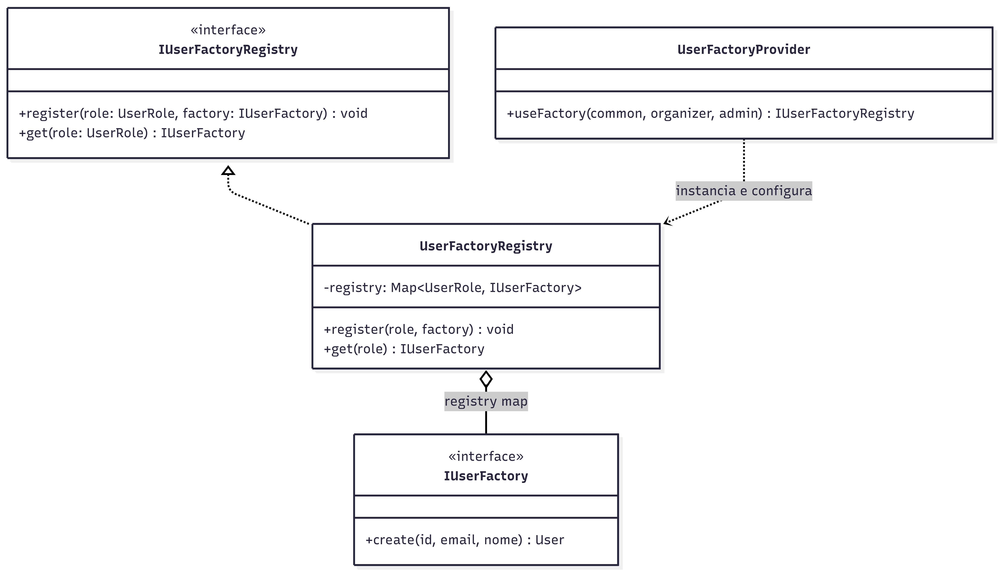

# 3.1.4 Abstract Factory

## Participantes

| Matrícula | Nome                                                  | Commits                                                                                                                   |
| :-------- | :---------------------------------------------------- | :------------------------------------------------------------------------------------------------------------------------ |
| 222015060 | [Ana Luiza](https://github.com/ana-pfeilsticker)      | [9dc1acc](https://github.com/UnBArqDsw2026-1-Turma01/2026.1-T01-_G5_BelezasNaturaisBrasileiras_Entrega_01/commit/9dc1acc) |
| 211062320 | [Miguel Arthur](https://github.com/zlimaz) | [dd90dd9](https://github.com/UnBArqDsw2026-1-Turma01/2026.1-T01-_G5_BelezasNaturaisBrasileiras_Entrega_01/commit/dd90dd9) |

## Introdução

O **Abstract Factory** é um padrão criacional que fornece uma interface para criar famílias de objetos relacionados ou dependentes sem especificar suas classes concretas. É especialmente útil quando um sistema deve funcionar com múltiplas famílias de objetos.

Este padrão promove a coesão entre produtos relacionados e facilita a troca de famílias inteiras de objetos sem modificar o código cliente.

## Quando Aplicar?

- Quando um sistema deve trabalhar independentemente de como seus produtos são criados
- Quando um sistema deve ser configurado com uma de várias famílias de produtos
- Quando você deseja fornecer uma biblioteca de produtos revelando apenas interfaces
- Quando produtos relacionados devem ser usados juntos e você quer garantir consistência
- Quando você precisa suportar múltiplas implementações de um subsistema inteiro

## Metodologia

O padrão Abstract Factory foi aplicado com o `UserFactoryRegistry`: um **registro central** que mapeia cada `UserRole` para sua `IUserFactory` correspondente, permitindo selecionar dinamicamente a factory correta sem condicionais no código cliente.

O problema: ao criar ou promover um usuário, o `CreateAccountUseCase` precisa obter a factory certa para a role desejada. Hardcodar `if (role === ADMIN) new AdminUserFactory()` no use case violaria o princípio Open/Closed e acoplaria o domínio às factories concretas.

Com o Registry, o use case injeta `IUserFactoryRegistry` e chama `registry.get(role).create(...)` — sem saber quais factories existem. As factories são registradas no `UserFactoryProvider` (camada de interface) durante a inicialização do módulo via `registry.register(role, factory)`, separando configuração de lógica.

## Estrutura e Participantes

| Classe                 | Papel no Padrão              | Responsabilidade                                                          |
| :--------------------- | :--------------------------- | :------------------------------------------------------------------------ |
| `IUserFactoryRegistry` | Abstract Factory (interface) | Contrato de registro e recuperação de factories por role                  |
| `UserFactoryRegistry`  | Concrete Factory             | Implementa o Map `UserRole → IUserFactory`                                |
| `UserFactoryProvider`  | Configurador                 | Registra as 3 factories concretas no registry durante bootstrap do módulo |

## Diagrama de Classes



## Descrição das Classes

**`IUserFactoryRegistry`** (`domain/interfaces/IUserFactoryRegistry.ts`)

Interface da Abstract Factory. Define `register(role, factory)` para cadastrar factories e `get(role)` para recuperá-las. O domínio depende apenas desta interface, nunca da implementação concreta.

**`UserFactoryRegistry`** (`infrastructure/factories/UserFactoryRegistry.ts`)

Implementação concreta usando `Map<UserRole, IUserFactory>`. O método `get()` lança uma exceção se nenhuma factory estiver registrada para a role solicitada, prevenindo criações silenciosamente incorretas.

**`UserFactoryProvider`** (`interface/providers/UserFactoryProvider.ts`)

Provider do NestJS que configura o registry no bootstrap da aplicação. Instancia o `UserFactoryRegistry` e registra as três factories concretas (`CommonUserFactory`, `OrganizerUserFactory`, `AdminUserFactory`) via `registry.register()`. Exposto como `'IUserFactoryRegistry'` no DI container.

## Trechos de Código

### `UserFactoryRegistry` — registro central de fábricas

> [`backend/src/modules/accounts/infrastructure/factories/UserFactoryRegistry.ts`](https://github.com/UnBArqDsw2026-1-Turma01/2026.1-T01-_G5_BelezasNaturaisBrasileiras_Entrega_01/blob/main/backend/src/modules/accounts/infrastructure/factories/UserFactoryRegistry.ts)

```typescript
@Injectable()
export class UserFactoryRegistry implements IUserFactoryRegistry {
  private registry: Map<UserRole, IUserFactory> = new Map();

  register(role: UserRole, factory: IUserFactory): void {
    this.registry.set(role, factory);
  }

  get(role: UserRole): IUserFactory {
    const factory = this.registry.get(role);
    if (!factory) throw new Error(`Factory não registrada para role: ${role}`);
    return factory;
  }
}
```

### Uso no `CreateAccountUseCase`

> [`backend/src/modules/accounts/application/use-cases/CreateAccountUseCase.ts`](https://github.com/UnBArqDsw2026-1-Turma01/2026.1-T01-_G5_BelezasNaturaisBrasileiras_Entrega_01/blob/main/backend/src/modules/accounts/application/use-cases/CreateAccountUseCase.ts)

```typescript
// O use case não conhece as factories concretas — apenas o registry
const role = input.role ?? UserRole.COMMON_USER;
const user = this.registry.get(role).create(id, input.email, input.nome);
```

## Vídeo de Demonstração

[Adicionar link para o vídeo de demonstração do padrão em funcionamento]

## Rotas Relacionadas

| Rota                | Método | Descrição                                                                       | Como Testar                                                                                                      |
| :------------------ | :----- | :------------------------------------------------------------------------------ | :--------------------------------------------------------------------------------------------------------------- |
| `/accounts/signup`  | `POST` | Usa `registry.get(UserRole.COMMON_USER)` para obter a factory e criar o usuário | `curl -X POST http://localhost:3000/accounts/signup -d '{"email":"x@x.com","password":"123456","nome":"Teste"}'` |
| `/accounts/promote` | `POST` | Usa `registry.get(newRole)` para obter a factory da role de destino             | Requer token JWT de ADMIN                                                                                        |

## Declaração de Uso de IA

Este documento e a implementação foram desenvolvidos com o auxílio do Claude para otimizar a estrutura, apresentação do conteúdo e codificação. Todas as decisões de implementação, modelagem de classes e escolhas arquiteturais foram realizadas pela equipe com senso crítico e autoridade própria.

O Claude foi utilizado como ferramenta de suporte em duas frentes:

**Documentação:**

- Otimização da estrutura e apresentação do padrão
- Refinamento da apresentação técnica
- Geração de exemplos e descrições

**Codificação:**

- Auxílio na criação da estrutura base do código
- A equipe utilizou de arquivos de especificação (specs) bem definidos para garantir que o Claude seguisse fielmente o planejamento
- As escolhas arquiteturais foram realizadas EXCLUSIVAMENTE pela equipe
- O Claude auxiliou na implementação mantendo todos os parâmetros e restrições estabelecidas pelo grupo

Cada implementação, diagrama e decisão foi revisado e alterado conforme as necessidades do projeto. A equipe mantém total responsabilidade pelas escolhas implementadas.

## Referências Bibliográficas

> Gamma, E., Helm, R., Johnson, R., & Vlissides, J. (1994). Design Patterns: Elements of Reusable Object-Oriented Software. Addison-Wesley.

> Refactoring Guru. Abstract Factory. Disponível em: https://refactoring.guru/design-patterns/abstract-factory. Acesso em: 18 mai. 2026.

> Freeman, E., Freeman, E., Kathy, S., & Bates, B. (2004). Head First Design Patterns. O'Reilly Media.

## Revisão Técnica

| Integrante | Revisão |
| :--------- | :------ |
| [Vitor Hoffmann](https://github.com/vitor-hoffmann) | O `UserFactoryRegistry` está mais próximo do padrão Service Locator do que de um Abstract Factory canônico do GoF, que cria famílias de objetos relacionados. A decisão é adequada para o domínio: o registro por enum elimina condicionais no use case. O método `get()` lança exceção para roles não registradas, aplicando fail-fast corretamente — criar objetos em estado inválido silenciosamente seria pior. O registro no `UserFactoryProvider` durante o bootstrap separa configuração de lógica, facilitando testes com factories mockadas. |

## Histórico de versões

| Versão | Data       | Descrição                                                                                                                       | Autor                                               | Revisor | Detalhamento da Revisão |
| :----- | :--------- | :------------------------------------------------------------------------------------------------------------------------------ | :-------------------------------------------------- | :------ | :---------------------- |
| `1.0`  | 18/05/2026 | Criação da estrutura do documento com seções de participantes, introdução, metodologia, estrutura de classes, diagrama e rotas. | [Ana Luiza](https://github.com/ana-pfeilsticker)    | [Vitor Hoffmann](https://github.com/vitor-hoffmann) | Verificação da correta aplicação do padrão Abstract Factory e clareza na documentação. |
| `1.1`  | 19/05/2026 | Preenchimento da metodologia, diagrama de classes, descrição das classes e rotas relacionadas.                                  | [Vitor Hoffmann](https://github.com/vitor-hoffmann) |         |                         |
| `1.2`  | 22/05/2026 | Adição de seção de revisão técnica. | [Vitor Hoffmann](https://github.com/vitor-hoffmann) | | |
