# 3.2.1 Adapter

## Participantes

| Matrícula  | Nome                                                    | Commits                                                                                                                                                    |
| :--------- | :------------------------------------------------------ | :--------------------------------------------------------------------------------------------------------------------------------------------------------- |
| 2220201998 | [Mateus Magno](https://github.com/mtsmgn0)              | [9eaacb1](https://github.com/UnBArqDsw2026-1-Turma01/2026.1-T01-_G5_BelezasNaturaisBrasileiras_Entrega_03/commit/9eaacb12b38b2d4012498f978b3b76332070d57a) |
|            | [Mário Vinícius](https://github.com/MarioViniciusBC)    | [9eaacb1](https://github.com/UnBArqDsw2026-1-Turma01/2026.1-T01-_G5_BelezasNaturaisBrasileiras_Entrega_03/commit/9eaacb12b38b2d4012498f978b3b76332070d57a) |
|            | [Antônio Carvalho](https://github.com/antonioscarvalho) | [9eaacb1](https://github.com/UnBArqDsw2026-1-Turma01/2026.1-T01-_G5_BelezasNaturaisBrasileiras_Entrega_03/commit/9eaacb12b38b2d4012498f978b3b76332070d57a) |

## Introdução

O **Adapter** é um padrão estrutural que converte a interface de uma classe em outra esperada pelos clientes, permitindo que classes incompatíveis trabalhem juntas. É útil quando você tem duas interfaces que não são compatíveis e precisa fazer com que funcionem em conjunto.

Este padrão funciona como um intermediário que traduz chamadas de uma interface para outra, permitindo integração sem modificação de código existente. No projeto Belezas Naturais Brasileiras, utilizamos este padrão para isolar o núcleo da aplicação de dependências externas como APIs de mapas, serviços de notificação e provedores de autenticação.

## Quando Aplicar?

- Quando você deseja usar uma classe existente, mas sua interface não corresponde à que você precisa.
- Quando deseja criar uma classe reutilizável que coopere com classes não relacionadas.
- Quando múltiplas subclasses de uma classe precisam ser adaptadas, mas é impraticável adaptar suas interfaces.
- Quando você precisa integrar bibliotecas ou frameworks externos com seu código.
- Quando deseja converter dados de um formato para outro.

## Metodologia

A implementação do padrão Adapter no sistema foi realizada através da definição de interfaces claras (`Target`) para cada serviço externo. Criamos adaptadores concretos (`Adapter`) que implementam essas interfaces e encapsulam a lógica específica de cada SDK ou biblioteca externa (`Adaptee`).

Utilizamos o sistema de Injeção de Dependência do NestJS para injetar as interfaces nos serviços de aplicação (`Client`), permitindo que a troca de um provedor externo (ex: trocar Twilio por AWS SNS) ocorra de forma transparente, alterando apenas a configuração no módulo, sem impactar a lógica de negócio.

## Estrutura e Participantes

| Classe                                                                  | Papel no Padrão    | Responsabilidade                                                                                  |
| :---------------------------------------------------------------------- | :----------------- | :------------------------------------------------------------------------------------------------ |
| `AdaptersController`                                                    | Client             | Endpoint que expõe as funcionalidades dos adaptadores para teste e uso externo.                   |
| `IAuthAdapter`, `IMapAdapter`, `INotificationAdapter`                   | Target (Interface) | Define o contrato esperado pela aplicação para os serviços de autenticação, mapas e notificações. |
| `GoogleAuthAdapter`, `LocalAuthAdapter`                                 | Adapter            | Adaptam as APIs do Google OAuth e JWT Local para a interface `IAuthAdapter`.                      |
| `GoogleMapsAdapter`                                                     | Adapter            | Adapta o Google Maps SDK para a interface `IMapAdapter`.                                          |
| `TwilioAdapter`                                                         | Adapter            | Adapta o Twilio SDK para a interface `INotificationAdapter`.                                      |
| `AuthAdapterService`, `MapAdapterService`, `NotificationAdapterService` | Service/Client     | Atuam como wrappers que utilizam a interface injetada para executar operações.                    |
| `GoogleMapsSDK`, `TwilioSDK`, `GoogleOAuthSDK`                          | Adaptee            | As bibliotecas externas reais que possuem interfaces incompatíveis com o sistema.                 |

## Diagrama de Classes



## Descrição das Classes

1.  **Interfaces (`Target`):** `IAuthAdapter`, `IMapAdapter` e `INotificationAdapter` definem os métodos que o sistema precisa. Elas garantem que qualquer novo provedor externo possa ser adicionado sem quebrar o código existente.
2.  **Adaptadores Concretos (`Adapter`):** `GoogleMapsAdapter`, `TwilioAdapter`, `GoogleAuthAdapter` e `LocalAuthAdapter` são as classes que realmente "falam" com os SDKs externos. Elas traduzem as chamadas do nosso sistema para o formato que a biblioteca externa entende.
3.  **Serviços de Aplicação (`Client`):** `MapAdapterService`, `NotificationAdapterService` e `AuthAdapterService` são os consumidores das interfaces. Eles não sabem qual provedor estão usando, apenas chamam os métodos definidos nas interfaces.
4.  **Controlador (`AdaptersController`):** Centraliza as requisições de teste para os adaptadores, servindo como ponto de entrada para verificar se as integrações estão funcionando corretamente.

## Trechos de Código

### Interface `IMapAdapter`

> [`backend/src/modules/adapters/map/interfaces/map-adapter.interface.ts`](https://github.com/UnBArqDsw2026-1-Turma01/2026.1-T01-_G5_BelezasNaturaisBrasileiras_Entrega_03/blob/main/backend/src/modules/adapters/map/interfaces/map-adapter.interface.ts)

```typescript
export interface IMapAdapter {
  geocode(address: string): Promise<LocationDto>;
  route(from: LocationDto, to: LocationDto, options?: any): Promise<RouteDto>;
  uploadMarkerImage?(file: any): Promise<string>;
}
```

### `GoogleMapsAdapter` — Adaptador Concreto

> [`backend/src/modules/adapters/map/google-maps.adapter.ts`](https://github.com/UnBArqDsw2026-1-Turma01/2026.1-T01-_G5_BelezasNaturaisBrasileiras_Entrega_03/blob/main/backend/src/modules/adapters/map/google-maps.adapter.ts)

```typescript
@Injectable()
export class GoogleMapsAdapter implements IMapAdapter {
  async geocode(address: string): Promise<LocationDto> {
    // Integração real com Google Maps SDK seria aqui
    return { lat: -15.7942, lng: -47.8822 };
  }

  async route(
    from: LocationDto,
    to: LocationDto,
    options?: any,
  ): Promise<RouteDto> {
    return { distance: 15.5, polyline: "..." };
  }
}
```

### Configuração no Módulo (Injeção de Dependência)

> [`backend/src/modules/adapters/adapters.module.ts`](https://github.com/UnBArqDsw2026-1-Turma01/2026.1-T01-_G5_BelezasNaturaisBrasileiras_Entrega_03/blob/main/backend/src/modules/adapters/adapters.module.ts)

```typescript
@Module({
  providers: [
    GoogleMapsAdapter,
    MapAdapterService,
    { provide: "IMapAdapter", useClass: GoogleMapsAdapter },
    // Para trocar o provedor, bastaria alterar o useClass acima
  ],
})
export class AdaptersModule {}
```

### Uso no Controlador (Client)

> [`backend/src/modules/adapters/adapters.controller.ts`](https://github.com/UnBArqDsw2026-1-Turma01/2026.1-T01-_G5_BelezasNaturaisBrasileiras_Entrega_03/blob/main/backend/src/modules/adapters/adapters.controller.ts)

```typescript
@Controller("adapters")
export class AdaptersController {
  constructor(
    private readonly mapAdapter: MapAdapterService,
    private readonly notifyAdapter: NotificationAdapterService,
    private readonly authAdapter: AuthAdapterService,
  ) {}

  @Post("geocode")
  geocode(@Body() body: { address: string }) {
    // O controlador delega para o serviço, que por sua vez usa o adaptador injetado
    return this.mapAdapter.geocode(body.address);
  }
}
```

## Vídeo de Demonstração

[Adicionar link para o vídeo de demonstração do padrão em funcionamento]

## Rotas Relacionadas

| Rota                      | Método | Descrição                                                | Como Testar                            |
| :------------------------ | :----- | :------------------------------------------------------- | :------------------------------------- |
| `/adapters/geocode`       | `POST` | Converte endereço em coordenadas via adaptador de mapas. | Enviar JSON `{"address": "Brasília"}`. |
| `/adapters/route`         | `POST` | Calcula rota entre pontos via adaptador de mapas.        | Enviar JSON com `from` e `to`.         |
| `/adapters/notify/sms`    | `POST` | Envia SMS via adaptador de notificações (Twilio).        | Enviar JSON com `to` e `message`.      |
| `/adapters/auth/validate` | `POST` | Valida callback de autenticação via adaptador (Google).  | Enviar dados retornados pelo OAuth.    |

## Declaração de Uso de IA

Este documento e a implementação foram desenvolvidos com o auxílio da IA para otimizar a estrutura, apresentação do conteúdo e codificação. Todas as decisões de implementação, modelagem de classes e escolhas arquiteturais foram realizadas pela equipe com senso crítico e autoridade própria.

A IA foi utilizada como ferramenta de suporte em duas frentes:

**Documentação:**

- Otimização da estrutura e apresentação do padrão.
- Refinamento da apresentação técnica e diagramação Mermaid.
- Geração de descrições baseadas no código implementado.

**Codificação:**

- Auxílio na criação da estrutura base do código seguindo o padrão NestJS.
- Garantia de que as interfaces seguissem fielmente o planejamento arquitetural.
- As escolhas arquiteturais (uso de injeção de interface) foram realizadas pela equipe.

Cada implementação, diagrama e decisão foi revisado e alterado conforme as necessidades do projeto. A equipe mantém total responsabilidade pelas escolhas implementadas.

## Referências Bibliográficas

> Gamma, E., Helm, R., Johnson, R., & Vlissides, J. (1994). Design Patterns: Elements of Reusable Object-Oriented Software. Addison-Wesley.

> Refactoring Guru. Adapter. Disponível em: https://refactoring.guru/design-patterns/adapter. Acesso em: 18 mai. 2026.

> Freeman, E., Freeman, E., Kathy, S., & Bates, B. (2004). Head First Design Patterns. O'Reilly Media.

## Histórico de versões

| Versão | Data       | Descrição                                                                                                                       | Autor                                            | Revisor | Detalhamento da Revisão           |
| :----- | :--------- | :------------------------------------------------------------------------------------------------------------------------------ | :----------------------------------------------- | :------ | :-------------------------------- |
| `1.0`  | 18/05/2026 | Criação da estrutura do documento com seções de participantes, introdução, metodologia, estrutura de classes, diagrama e rotas. | [Ana Luiza](https://github.com/ana-pfeilsticker) |         |                                   |
| `1.1`  | 21/05/2026 | Detalhamento da implementação real dos adaptadores de Mapa, Notificação e Autenticação conforme o diagrama de classes.          | [Mateus Magno](https://github.com/mtsmgn0)       |         | |
