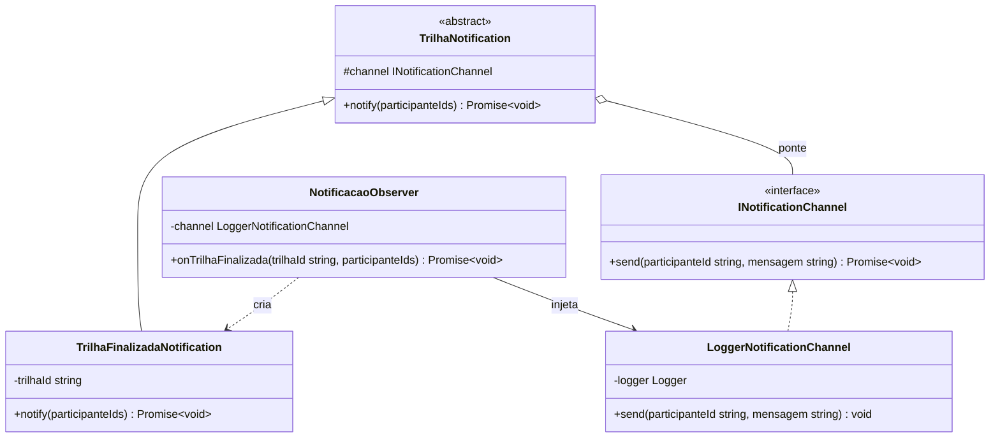

# 3.2.2 Bridge

## Participantes

| Matrícula | Nome | Commits |
| :-------- | :--- | :------ |
| 221031229 | [Paulo Filho](https://github.com/PauloFilho2) | [ba65a7d](https://github.com/UnBArqDsw2026-1-Turma01/2026.1-T01-_G5_BelezasNaturaisBrasileiras_Entrega_03/commit/ba65a7d54f3ec41b0ebe56021e6f945c17d3534a) |
|  | [Heloisa Santos](https://github.com/Heloisa-Santos) | [ba65a7d](https://github.com/UnBArqDsw2026-1-Turma01/2026.1-T01-_G5_BelezasNaturaisBrasileiras_Entrega_03/commit/ba65a7d54f3ec41b0ebe56021e6f945c17d3534a) |

## Introdução

O **Bridge** é um padrão estrutural que desacopla uma abstração de sua implementação, permitindo que ambas variem independentemente. É útil quando você deseja evitar uma explosão de classes resultante da combinação de múltiplas abstrações e implementações.

Este padrão funciona através de uma ponte que conecta abstrações e implementações, permitindo que mudanças em uma não afetem a outra.

## Quando Aplicar?

- Quando você deseja evitar uma ligação permanente entre abstração e implementação
- Quando mudanças na implementação não devem afetar os clientes
- Quando múltiplas implementações de uma abstração devem ser suportadas
- Quando você tem uma hierarquia de classe que cresce exponencialmente
- Quando deseja compartilhar uma implementação entre múltiplos objetos

## Metodologia

O padrão Bridge foi aplicado no fluxo de notificações relacionadas à finalização de uma trilha. Quando uma trilha é finalizada, o sistema precisa avisar os participantes que o badge está disponível. Essa regra envolve duas partes que podem variar separadamente:

- o **tipo da notificação**, por exemplo notificação de trilha finalizada;
- o **canal de envio**, por exemplo logger, e-mail, push notification ou WhatsApp.

Sem o Bridge, cada combinação poderia gerar uma classe diferente, como `NotificacaoTrilhaFinalizadaPorLogger`, `NotificacaoTrilhaFinalizadaPorEmail` e assim por diante. Isso aumentaria a quantidade de classes e deixaria o código mais acoplado.

Com o Bridge, a notificação de domínio (`TrilhaNotification` e `TrilhaFinalizadaNotification`) fica separada do canal de envio (`INotificationChannel` e `LoggerNotificationChannel`). A notificação conhece apenas a interface do canal, não os detalhes concretos de entrega. Assim, é possível criar novos canais futuramente sem alterar a lógica da notificação.

A implementação foi integrada ao `NotificacaoObserver`, que já participava do fluxo de finalização da trilha. Quando o observer recebe o evento de trilha finalizada, ele cria uma `TrilhaFinalizadaNotification` e delega o envio para o canal configurado.

## Estrutura e Participantes

| Classe                       | Papel no Padrão        | Responsabilidade                                                                  |
| :--------------------------- | :--------------------- | :-------------------------------------------------------------------------------- |
| `TrilhaNotification`         | Abstraction            | Define a base das notificações de trilha e mantém a referência para o canal        |
| `TrilhaFinalizadaNotification` | Refined Abstraction  | Representa a notificação específica de trilha finalizada                           |
| `INotificationChannel`       | Implementor            | Define o contrato comum para qualquer canal de envio                               |
| `LoggerNotificationChannel`  | Concrete Implementor   | Envia a mensagem usando o `Logger` do NestJS                                       |
| `NotificacaoObserver`        | Cliente                | Recebe o evento de finalização e dispara a notificação pelo canal configurado      |

## Diagrama de Classes

## Descrição das Classes

**`INotificationChannel`** (`domain/notifications/INotificationChannel.ts`)

Interface que representa o lado da implementação no Bridge. Define o método `send(participanteId, mensagem)`, que qualquer canal concreto deve implementar. Essa interface permite que a notificação use um canal sem conhecer seus detalhes internos.

**`LoggerNotificationChannel`** (`domain/notifications/LoggerNotificationChannel.ts`)

Implementação concreta do canal de envio. Usa o `Logger` do NestJS para registrar a mensagem da notificação. Foi escolhida como primeira implementação por ser simples e suficiente para demonstrar o padrão sem depender de serviços externos.

**`TrilhaNotification`** (`domain/notifications/TrilhaNotification.ts`)

Abstração base das notificações de trilha. Recebe um `INotificationChannel` no construtor e define o método abstrato `notify()`. Essa classe representa a ponte entre a regra de notificação e o mecanismo de envio.

**`TrilhaFinalizadaNotification`** (`domain/notifications/TrilhaFinalizadaNotification.ts`)

Abstração refinada. Monta a mensagem de trilha finalizada e envia essa mensagem para todos os participantes recebidos. Ela não sabe se a mensagem será registrada em log, enviada por e-mail ou entregue por outro canal; apenas chama `this.channel.send()`.

**`NotificacaoObserver`** (`domain/observers/NotificacaoObserver.ts`)

Cliente do Bridge dentro do fluxo do projeto. Ao receber o evento `onTrilhaFinalizada`, instancia `TrilhaFinalizadaNotification` com o canal configurado e chama `notify(participanteIds)`.

## Vídeo de Demonstração

[Adicionar link para o vídeo de demonstração do padrão em funcionamento]

## Rotas Relacionadas

| Rota                     | Método | Descrição                                                                 | Como Testar                             |
| :----------------------- | :----- | :------------------------------------------------------------------------ | :-------------------------------------- |
| `/trilhas/:id/finalizar` | `POST` | Finaliza a trilha, dispara os observers e usa o Bridge para notificar     | Requer token JWT do organizador         |
| `/trilhas/status`        | `GET`  | Permite verificar a quantidade de observers registrados no fluxo de trilha | `curl http://localhost:3000/trilhas/status` |

## Declaração de Uso de IA

Este documento e a implementação foram desenvolvidos com o auxílio do Claude para otimizar a estrutura, apresentação do conteúdo e codificação. Todas as decisões de implementação, modelagem de classes e escolhas arquiteturais foram realizadas pela equipe com senso crítico e autoridade própria.

O Claude foi utilizado como ferramenta de suporte em duas frentes:

**Documentação:**

- Otimização da estrutura e apresentação do padrão
- Refinamento da apresentação técnica
- Geração de exemplos e descrições

**Codificação:**

- Auxílio na criação da estrutura base do código
- A equipe utilizou de arquivos de especificação (specs) bem definidos para garantir que o Claude seguisse fielmente o planejamento
- As escolhas arquiteturais foram realizadas EXCLUSIVAMENTE pela equipe
- O Claude auxiliou na implementação mantendo todos os parâmetros e restrições estabelecidas pelo grupo

Cada implementação, diagrama e decisão foi revisado e alterado conforme as necessidades do projeto. A equipe mantém total responsabilidade pelas escolhas implementadas.

## Referências Bibliográficas

> Gamma, E., Helm, R., Johnson, R., & Vlissides, J. (1994). Design Patterns: Elements of Reusable Object-Oriented Software. Addison-Wesley.

> Refactoring Guru. Bridge. Disponível em: https://refactoring.guru/design-patterns/bridge. Acesso em: 18 mai. 2026.

> Freeman, E., Freeman, E., Kathy, S., & Bates, B. (2004). Head First Design Patterns. O'Reilly Media.

## Histórico de versões

| Versão | Data       | Descrição                                                                                                                       | Autor                                            | Revisor | Detalhamento da Revisão |
| :----- | :--------- | :------------------------------------------------------------------------------------------------------------------------------ | :----------------------------------------------- | :------ | :---------------------- |
| `1.0`  | 18/05/2026 | Criação da estrutura do documento com seções de participantes, introdução, metodologia, estrutura de classes, diagrama e rotas. | [Ana Luiza](https://github.com/ana-pfeilsticker) |         |                         |
| `1.1`  | 21/05/2026 | Preenchimento da aplicação do Bridge no fluxo de notificações de trilhas finalizadas, com diagrama Mermaid e rotas relacionadas. | [Paulo Filho](https://github.com/PauloFilho2) |  [Heloisa Santos](https://github.com/Heloisa-Santos)       |                         |
